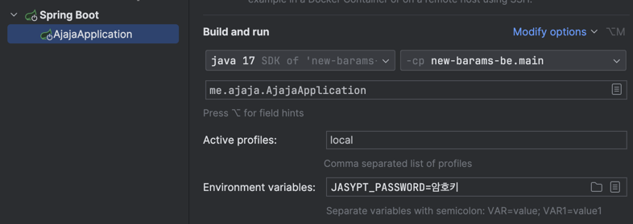

[](https://github.com/New-Barams/This-Year-Ajaja-BE/actions/workflows/ajaja-server-release.yml) [](https://github.com/New-Barams/This-Year-Ajaja-BE/actions/workflows/ajaja-run-server.yml)

# 👊🏻 올해도 아좌좌
- Owners : [@Hejow](https://github.com/Hejow) [@2jie0516](https://github.com/2jie0516) [@kys0411](https://github.com/kys0411) [@JuwoongKim](https://github.com/JuwoongKim)
- [API 문서 링크](https://api.ajaja.me/docs/index.html)

<br>

## 💻 로컬에서 시작하기
로컬 환경은 `docker`를 사용합니다.<br>
설치 스크립트 실행 후 `container`가 생성됩니다. 
```sh
sh ./container/download ## 설치
sh ./container/start ## 시작
sh ./container/stop ## 정지
sh ./container/remove ## 삭제
```

<br>

## 🔑 암호키 (Jasypt)
애플리케이션은 [Jasypt](http://www.jasypt.org/)로 노출에 민감한 값을 관리합니다.<br>
암호키는 담당자(`gmlwh124@naver.com`)에게 요청바랍니다.

```bash
## 사용법
java -jar --spring.profiles.active=${프로필} --JASYPT_PASSWORD=${암호키}
```
- IDE 적용하기



<br>

## ✅ 코드 컨벤션
[naver 컨벤션](https://naver.github.io/hackday-conventions-java/)을 따르고 있으므로 [Formatter 링크](https://github.com/naver/hackday-conventions-java/blob/master/rule-config/naver-intellij-formatter.xml)에 접속 후 다운받아 적용합니다.<br>
모든 간격(`tab size`, `indent` `continuation indent`)은 2로 사용합니다.

<br>

## 📦 패키지 구조
헥사고날 아키텍처를 사용합니다.

<details>
  <summary>구조 보기</summary>

        root
          ├── global
          ├── infra
          └── module
            ├── plan
            ├── ...
            └── user
                 ├── adapter
                 │  ├── in
                 │  │    ├── ...
                 │  │    └── web (package-private)
                 │  └── out
                 │       ├── ...
                 │       └── persistence (package-private)
                 ├── application
                 │   ├── service (package-private)
                 │   └── port
                 │       ├── in  (public)
                 │       └── out (public)
                 ├── domain
                 └── mapper
</details>
